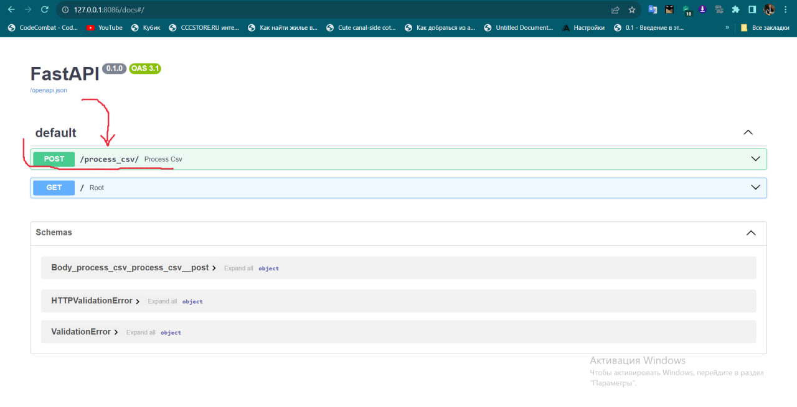
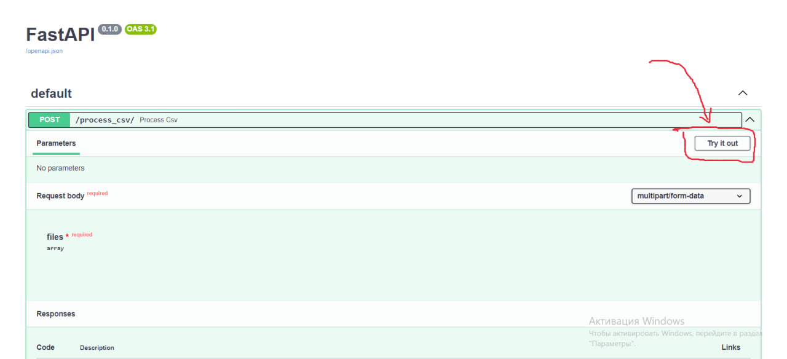
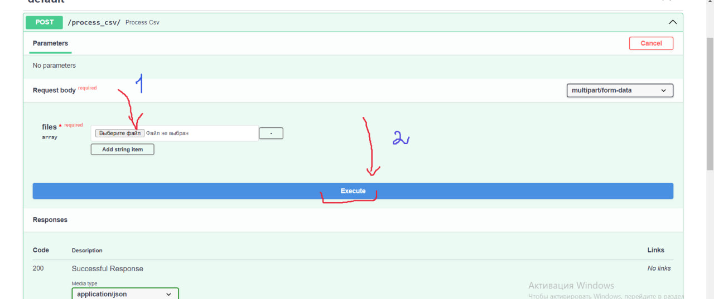

# preinstalls
Python 3.11.5
# build docker image
docker build -t server_dublicates .
# run docker server(Ubuntu)
docker run --gpus all -v $(pwd)/uploaded_files:/app/uploaded_files -p 8084:8084 server_dublicates
# UI
go to:  
    localhost:8084/docs

Step 1:

Step 2:

Step3:

load your dataset: 
    <your_dataset>.csv

result dataset will be: 
    ./uploaded_files/deduplicated_<your_dataset>.csv

